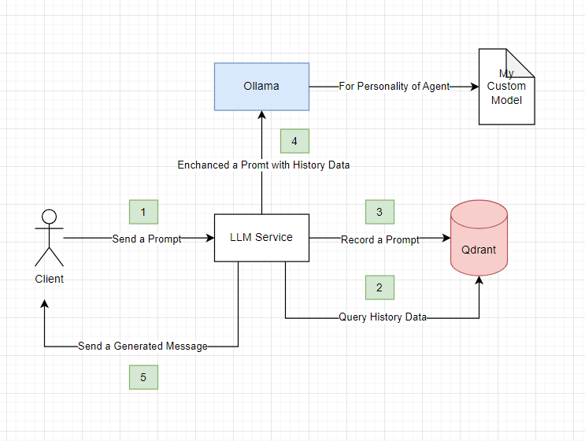

# 🦀🦀🦀 Rust LLM Included the RAG

This project is to shake the RUST off of my machine learning skills and learn about the emerging technologies in this era, particularly large language models (LLMs).

# 📹 Demo Video

# 📐 Architecture

# 🚀 Tech Stack

- [Qdrant](https://docs.rs/socketioxide/latest/socketioxide/)
- [Axum](https://docs.rs/axum/latest/axum/)
- [Socketoxide](https://docs.rs/socketioxide/latest/socketioxide/)
- [Ollama](https://ollama.com/)

# 👩‍🏭 LLM Model

- dolphin-mistral:latest

# 🧙‍♂️ Embedding Model

- [nomic-ai/nomic-embed-text-v1](https://huggingface.co/nomic-ai/nomic-embed-text-v1)

# 🎢 Collection Distacing

- Cosine

## 🧠 What is RAG ???

The RAG (Retrieval-Augmented Generation) is the process of optimizing the output of a large language model, so it references an authoritative knowledge base outside of its training data sources before generating a response.

In other words, when you need a LLM to remember historical information, you engage in a conversation where your inputs are stored in a vector database. In subsequent interactions, you retrieve related historical data from this database, combine it with your current prompt, and use this enhanced prompt to continue the conversation with the model.

# 📑 References

- [What RAG is](<https://aws.amazon.com/what-is/retrieval-augmented-generation/#:~:text=Retrieval%2DAugmented%20Generation%20(RAG),sources%20before%20generating%20a%20response.>)
- [Qdrant](https://qdrant.tech/documentation/overview/)
- [Building a RAG Web Service with Qdrant and Rust](https://www.shuttle.rs/blog/2024/02/28/rag-llm-rust)
